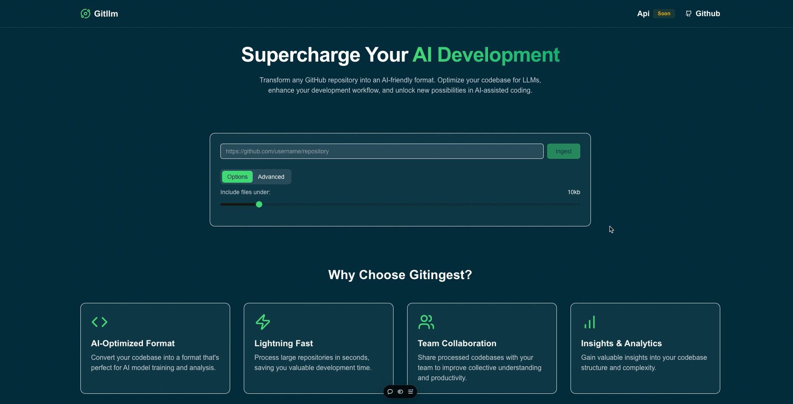

#  Gitllm


A powerful GitHub repository analysis tool that helps you process and analyze repository content efficiently. Built with Next.js, Cloudflare Workers, and modern web technologies.  

  

[try here]([public/demo.gif](https://gitllm.vercel.app/))

## 🌟 Features

- 📊 Repository content analysis
- 🔍 Smart file filtering
- 📝 Multiple output formats (JSON, TXT, YAML)
- ⚡ Powered by Cloudflare Workers
- 🔒 Secure API with rate limiting
- 💻 Clean and modern UI
- 🌓 Dark mode support
- 📱 Responsive design

## 🛠️ Tech Stack

- **Frontend**
  - Next.js 14
  - TypeScript
  - Tailwind CSS
  - Shadcn/ui
  - Lucide Icons

- **Backend**
  - Cloudflare Workers
  - Hono
  - KV Storage

## 🚀 Getting Started

### Prerequisites

- Node.js 18+
- npm/pnpm
- Cloudflare account
- GitHub token (for API access)

### Installation

1. Clone the repository
```bash
git clone https://github.com/abakermi/gitllm.git
cd gitllm
```

2. Install dependencies
```bash
npm install
```


## 📝 Environment Variables

### Frontend
- `WORKER_URL`: Cloudflare Worker URL
### Worker
- `KV_NAMESPACE_ID`: Cloudflare KV namespace ID


## 👨‍💻 Author

**Abakermi**
- GitHub: [@abakermi](https://github.com/abakermi)
- Twitter: [@abakermi](https://twitter.com/abakermi)

## 🙏 Acknowledgments

- Built during Natiobal holiday
- Powered by Cloudflare Workers
- UI components from shadcn/ui
- Icons from Lucide

---
Made with 🎄 by [abakermi](https://github.com/abakermi)